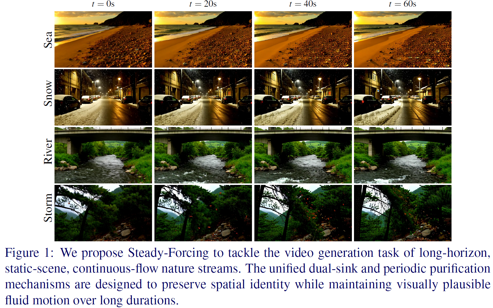

<div align="center">
  <h1>Steady-Forcing: Balancing Spatial Persistence and Motion Continuity in Long-Horizon Nature Video Diffusion</h1>
  <div>
    <p align="center">
        <a href="https://arxiv.org/abs/2606.14732">
            
        </a>
        <a href="https://github.com/minar09/steady-forcing">
            
        </a>
        <a href="https://www.huggingface.co/minar09/Steady-Forcing-T2V-1.3B">
            
        </a>
        <a href="https://minar09.github.io/steadyforcing/">
            
        </a>
    </p>
  </div>
  <br>
</div>

## ✍️ Authors
[Matiur Rahman Minar](https://minar09.github.io/)<sup>1</sup>, [Seunghun Oh](https://owinhun.github.io/)<sup>2</sup>, [Ganghyeon Jeong](https://github.com/Jugahy)<sup>2</sup>, [Unsang Park](https://cviplab.sogang.ac.kr/cviplab/1249.html)<sup>1,2</sup>  
<sup>1</sup>[Department of Computer Science and Engineering, Sogang University](https://ecs.sogang.ac.kr/ecs/index_new.html) &nbsp; <sup>2</sup>[Department of Artificial Intelligence, Sogang University](https://ai.sogang.ac.kr/ai/index_new.html)

## 🚀 Progress

- [ ] 📝 Technical Report / Paper
- [x] 🌐 Project Homepage
- [x] 💻 Training & Inference Code
- [x] 🤗 Pretrained Model: T2V-1.3B

## 🎯 Overview

Steady-Forcing produces long-horizon nature video rollouts from a fixed-camera view. It decouples spatial persistence from motion continuity via a structural dual-memory protocol. This enables stable backgrounds and sustained fluid motion.

<div align="center">
  
</div>

> **TL;DR**: We propose a dual-memory framework that balances stability and motion to sustain high background persistence and continuous fluid dynamics over multi-minute horizons for fixed-camera nature video generation.

## 📋 Table of Contents

- [Requirements](#-requirements)
- [Installation](#-installation)
- [Pretrained Checkpoints](#-pretrained-checkpoints)
- [Inference](#-inference)
- [Training](#-training)
- [Results](#-results)
- [Citation](#-citation)
- [Acknowledgements](#-acknowledgements)

## 🔧 Requirements

- Nvidia GPU with at least 24 GB memory (tested on NVIDIA A100 with 80 GB VRAM)
- Linux operating system

Other hardware may work but has not been tested.

## 🛠️ Installation

Create a Python 3.10 environment, install dependencies, and download models:

```bash
bash setup_env.sh
```

## 📦 Pretrained Checkpoints

### Download text prompts and ODE initialization checkpoint
```bash
hf download minar09/Steady-Forcing-T2V-1.3B --local-dir ./ckpt
```

> Note: The training algorithm is data-free distillation; no video data is needed.

### File Structure
After downloading, organize the checkpoints and prompts as follows:
```
steady-forcing/
├── prompts/
├── ckpt/
    └── steady-forcing-t2v.pt
```

## 🚀 Inference

Run inference with the provided script:

```bash
bash inference.sh
```

## 🏋️ Training

The repository can also be used for training and evaluation.

### Self-Forcing training with DMD
```bash
bash train.sh
```

This training recipe was completed in under 67 hours on 8 A100 GPUs.

## 📊 Results

Quantitative and qualitative results are available in the [paper](https://arxiv.org/abs/2606.14732). For detailed comparisons and visualizations, please refer to the arXiv preprint. For viewing generated videos, please visit the [project page](https://minar09.github.io/steadyforcing/).

## 📄 Citation

If you use this codebase, please cite:

```bibtex
@article{minar2025steady,
  title={Steady-Forcing: Balancing Spatial Persistence and Motion Continuity in Long-Horizon Nature Video Diffusion},
  author={Minar, Matiur Rahman and Oh, Seunghun and Jeong, Ganghyeon and Park, Unsang},
  journal={arXiv preprint arXiv:2606.14732},
  year={2026}
}
```

## 🤝 Acknowledgements

This project builds on the open-source [Infinity-RoPE](https://github.com/yesiltepe-hidir/infinity-rope) and [Reward-Forcing](https://github.com/JaydenLyh/Reward-Forcing) implementation and acknowledges related work in long-horizon video diffusion, motion continuity, and spatial persistence. We sincerely appreciate their efforts and thank them.
